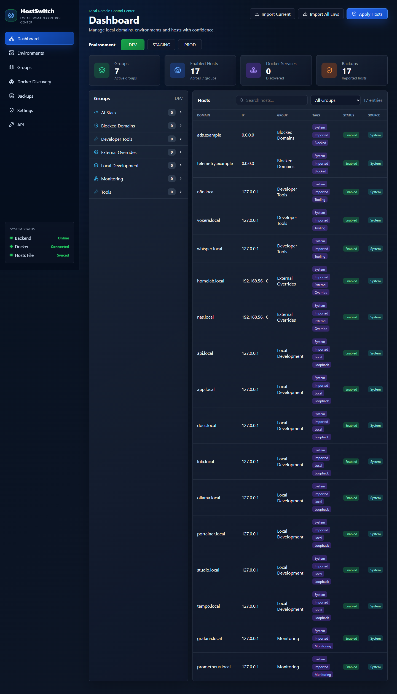
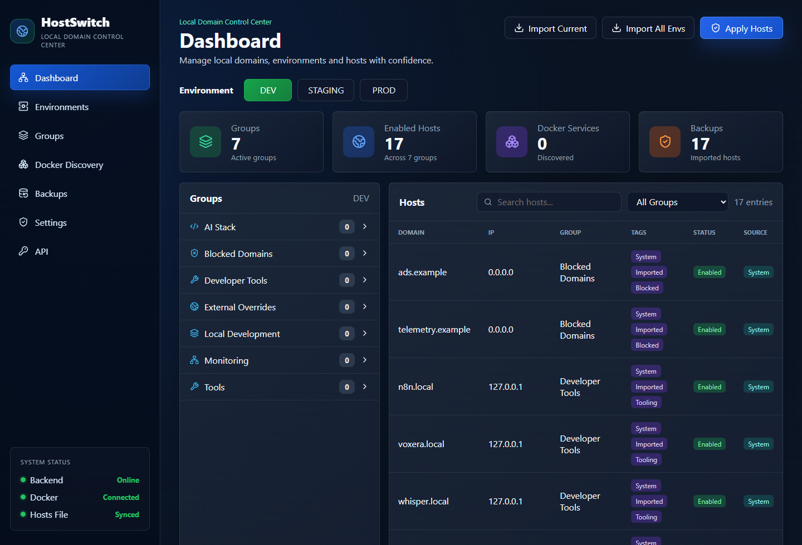
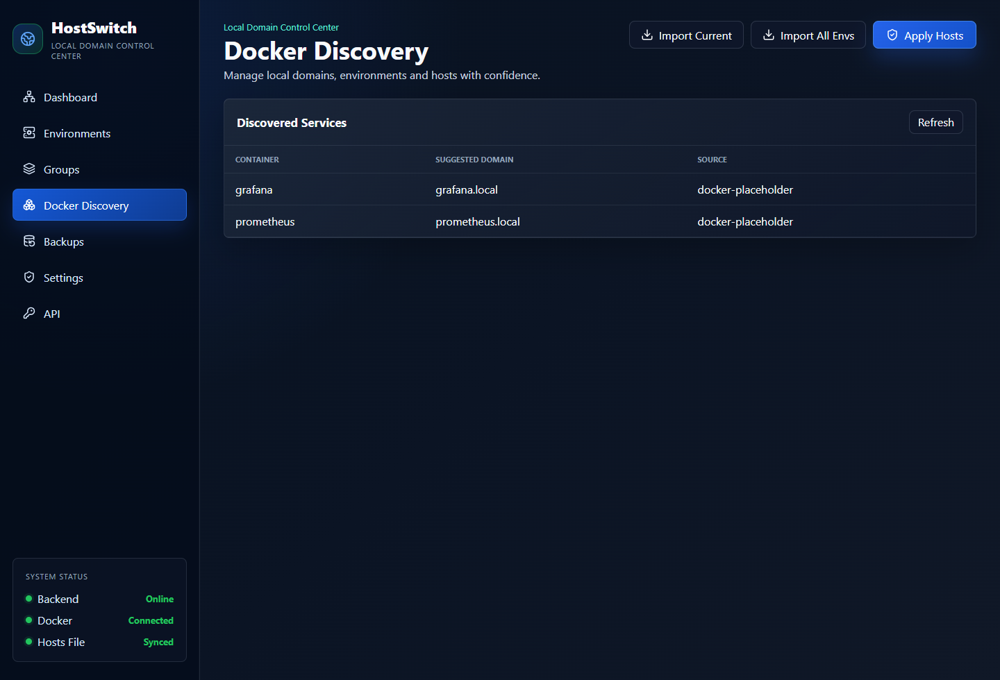
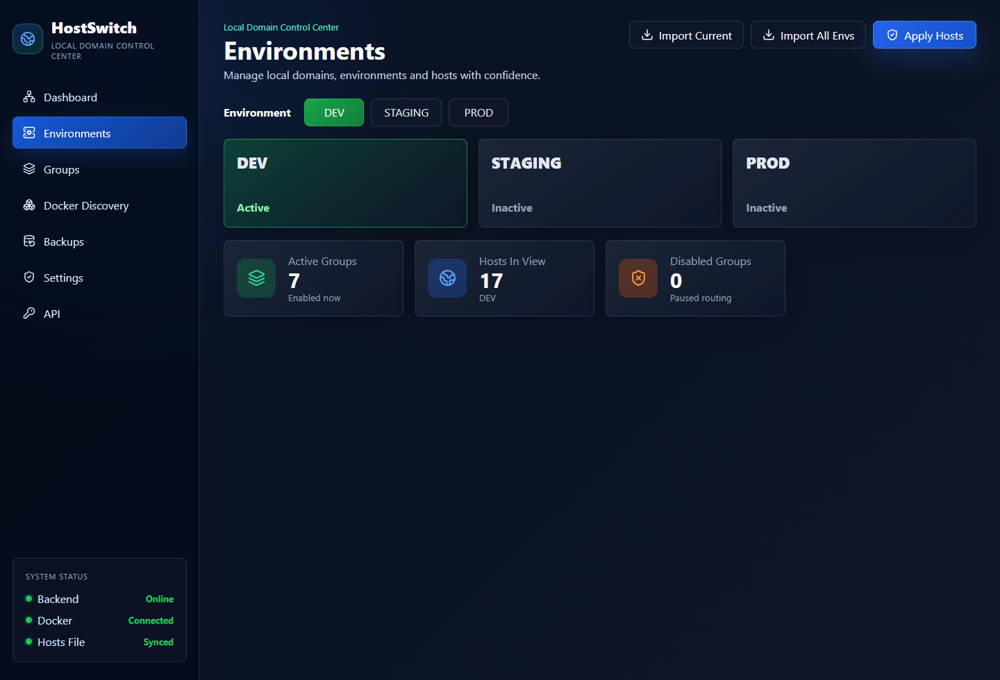
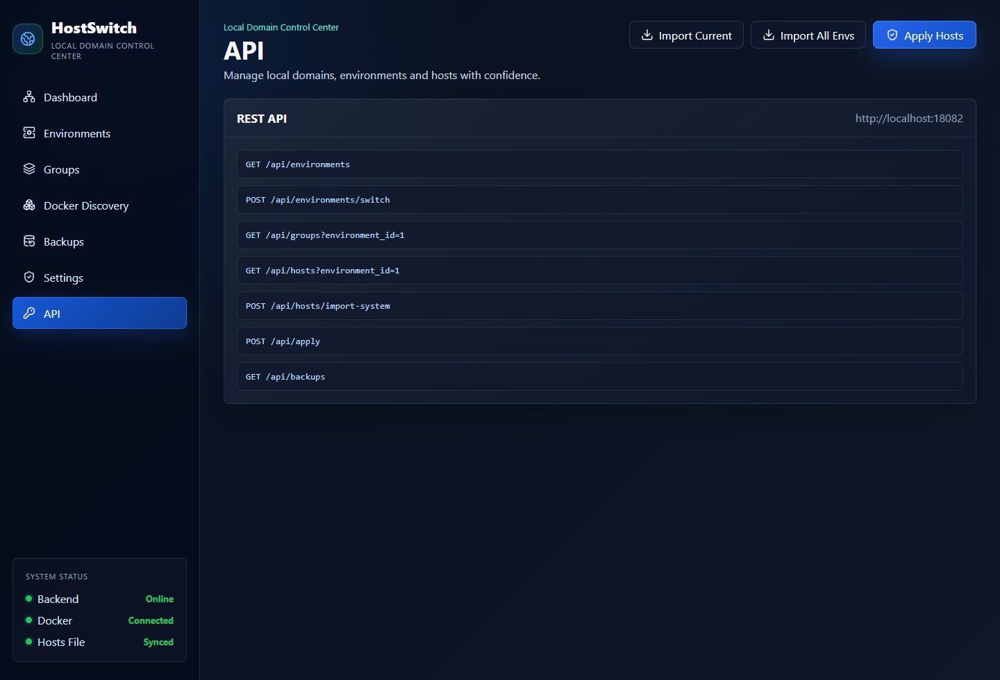

# HostSwitch

<div align="center">

### Modern Local Domain Control Center for Developers & DevOps

Manage hosts files, environments, Docker services, and local domain routing from a modern web interface.

---



</div>

---

# ✨ Features

## 🌍 Environment Switching

Instantly switch between:

* DEV
* STAGING
* PROD

without manually editing hosts files.

---

## 📁 Group-Based Organization

Organize domains into logical groups:

* AI Stack
* Monitoring
* Developer Tools
* Docker & Kubernetes
* Networking
* Blocked Domains

---

## 🐳 Docker Auto Discovery

Automatically detect running containers and generate local domains.

Example:

```text
Grafana    → grafana.local
Prometheus → prometheus.local
Ollama     → ollama.local
N8N        → n8n.local
```

---

## 💾 Automatic Backup & Restore

Every apply operation creates a backup automatically.

Rollback safely anytime.

---

## ⚡ Apply Hosts Safely

HostSwitch renders and applies hosts changes through a dedicated host manager.

No more manual editing of:

```text
/etc/hosts
```

or

```text
C:\Windows\System32\drivers\etc\hosts
```

---

## 🔌 REST API

Automate HostSwitch using API endpoints.

Examples:

```http
GET  /api/environments
POST /api/environments/switch
GET  /api/hosts
POST /api/apply
```

---

## 🧠 Local DNS Mode (Roadmap)

Future versions will support:

* wildcard domains
* local DNS server
* DNS forwarding
* DNS caching

Example:

```text
*.local.dev
```

---

# 🚀 Why HostSwitch?

Most hosts management tools are:

* outdated
* desktop-only
* difficult to automate
* not container-aware
* lacking backups and organization

HostSwitch brings together:

```text
Hosts Management
+ Docker Discovery
+ Environment Switching
+ Backups
+ API Automation
+ Modern UI
```

in one unified platform.

---

# 🖥 Dashboard Preview

## Main Dashboard



---

## Docker Discovery



---

## Environment Switching



---

## API Access



---

# 🏗 Architecture

```text
HostSwitch
│
├── Backend (Go)
│   ├── REST API
│   ├── Hosts Manager
│   ├── Backup Engine
│   ├── Docker Discovery
│   └── DNS Engine
│
├── Frontend (React + Tailwind)
│
├── Database (SQLite)
│
└── Deployment (Docker)
```

---

# 📦 Repository Structure

```text
backend/      Go API and core services
frontend/     React dashboard
scripts/      Bootstrap and development scripts
data/         Local development data and preview hosts
```

---

# 🚀 Quick Start

## Requirements

* Docker Desktop
* Node.js 20+
* PowerShell (Windows)

---

## Start Development Environment

```powershell
./scripts/bootstrap.ps1 -Task dev
```

Frontend:

```text
http://localhost:5173
```

Backend API:

```text
http://localhost:18080
```

---

# 🐳 Docker Deployment

## Run with Docker

```bash
docker compose up -d
```

---

# ⚙ Local Development Tasks

## Install Dependencies

```powershell
./scripts/bootstrap.ps1 -Task deps
```

## Build

```powershell
./scripts/bootstrap.ps1 -Task build
```

## Run Tests

```powershell
./scripts/bootstrap.ps1 -Task test
```

## Start Development Mode

```powershell
./scripts/bootstrap.ps1 -Task dev
```

## Stop Development Mode

```powershell
./scripts/bootstrap.ps1 -Task dev-down
```

---

# 🔒 Safe Development Mode

By default, HostSwitch does NOT write to your real system hosts file.

Development mode uses:

```text
./data/hosts.preview
```

This allows:

* safe UI development
* previews
* testing apply operations
* backup testing

without modifying the real system configuration.

---

# 🧩 Docker Discovery

HostSwitch can automatically detect Docker containers.

Example:

```text
grafana     → grafana.local
prometheus  → prometheus.local
ollama      → ollama.local
```

Future support will include:

* Docker labels
* auto import rules
* automatic grouping
* Kubernetes discovery

---

# 📚 API Snapshot

## Health

```http
GET /api/health
```

## Environments

```http
GET  /api/environments
POST /api/environments
POST /api/environments/switch
```

## Groups

```http
GET   /api/groups
POST  /api/groups
PATCH /api/groups/{id}
```

## Hosts

```http
GET    /api/hosts
POST   /api/hosts
PATCH  /api/hosts/{id}
DELETE /api/hosts/{id}
```

## Apply Hosts

```http
POST /api/apply
```

## Backups

```http
GET  /api/backups
POST /api/backups
POST /api/backups/restore
```

## Docker Discovery

```http
GET /api/docker/discover
```

---

# 🛣 Roadmap

## Phase 1 — Core Platform

* hosts manager
* environment switching
* groups
* backups
* dashboard UI
* Docker deployment

## Phase 2 — Smart Discovery

* Docker auto discovery
* Docker label support
* service imports

## Phase 3 — Automation

* API tokens
* webhooks
* automation support

## Phase 4 — Local DNS Mode

* wildcard domains
* DNS forwarding
* local DNS server

## Phase 5 — Enterprise Features

* Git sync
* RBAC
* SSO
* audit logs
* Kubernetes discovery

---

# 🤝 Contributing

Contributions, feature requests, and ideas are welcome.

Please open:

* Issues
* Discussions
* Pull Requests

---

# ⭐ Vision

HostSwitch aims to become:

> The modern local domain control center for developers.

A unified platform for:

* hosts management
* Docker service routing
* local DNS
* environment switching
* developer productivity

---

# 📄 License

MIT License

---

<div align="center">

### HostSwitch

Modern local domain control center for developers and DevOps.

</div>
